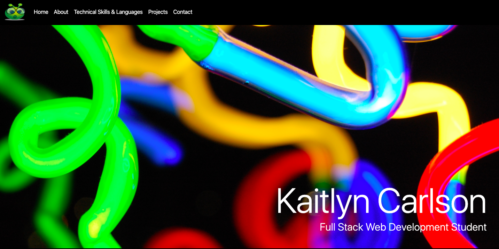

# Kaitlyn Carlson Portfolio of Work

[View Portfolio](https://kaitlyncarlson.github.io/Updated_Portfolio/ "Portfolio")
## Table of Contents

[Purpose](#Purpose)

[Functionality](#Functionality)

[Technologies Used](#Technologies-Used)

[Learn More](#Learn-More)

## Purpose

Updating my portfolio so that it reflects my skills and growth as a developer as I progess through the UW Full Stack Web Developer Bootcamp. In it's current state, this portfolio reflects my abilities as a Front End Web Developer. This portfolio contains information on my skills and abilities as a Web Developer, displays an emedded version of my resume which will always be up to date for potential employers, and demonstrates my coding capabilities.

## Functionality

The code architecture of my portfolio focuses largely on utilizing HTML and CSS. JavaScript was utilized in order to dynamically create effects in an effort to create an enjoyable UX and UI for potential visitors, and links to my professional resources and medias.

## Technologies Used

- HTML
- CSS
- JavaScript
- jQuery
- AOS (Animate on Scroll) [Visit resource](https://michalsnik.github.io/aos/)
- BootStrap
- Font Awesome

## Resume

## Learn More

[Visit me on LinkedIn](https://www.linkedin.com/in/kaitlynannecarlson/)
